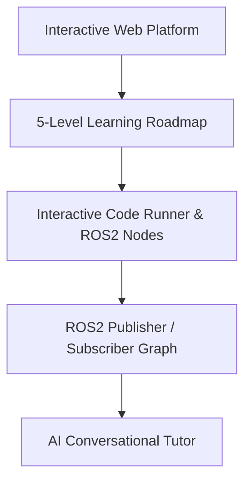

# ROS2 Learning Academy & Interactive Tutorials

---

## 📌 Project Overview

Comprehensive self-paced web platform for learning ROS2 (Robot Operating System 2). Features a 5-level progressive roadmap (Foundations → Expert), 60+ hands-on modules, code challenges, progress tracking, and dedicated AI assistant.

This project is an engineering module built by **DJIDEL Abdelali Rayan** (Systems & Automation Engineer, USTHB).

---

## 🏗️ System Architecture & Data Flow

---

## 🛠️ Key Technologies & Frameworks

- **ROS2 Jazzy**
- **React**
- **TypeScript**
- **Robotics Pedagogy**
- **Interactive Tutorials**

---

## 🚀 Live Interactive Web Demo

No installation required! Test and interact with the full web simulation live in your browser:
🔗 **[Launch Interactive Web Demo](https://djidelabdelali.github.io/ros2-learning-academy/)**

---

## 🔗 Connected Portfolio Ecosystem

- 🌐 **Main Portfolio**: [djidelabdelali.github.io/portfolio](https://djidelabdelali.github.io/portfolio/)
- 💻 **GitHub Profile**: [github.com/DjidelAbdelali](https://github.com/DjidelAbdelali)
- 💼 **LinkedIn Profile**: [DJIDEL Abdelali Rayan](https://linkedin.com/in/djidel-abdelali-rayan-814b25207)

---

  Developed by DJIDEL Abdelali Rayan — Systems & Automation Engineering

